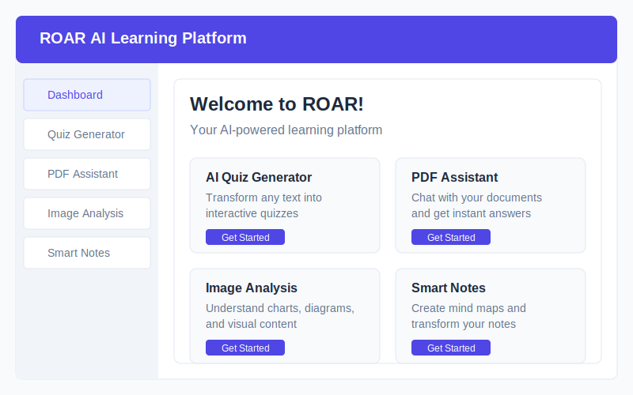

# ROAR AI Learning Platform

<div align="center">
  
  <p><strong>AI-powered educational tools for interactive learning</strong></p>
  
  [](https://opensource.org/licenses/MIT)
  [](https://reactjs.org/)
  [](https://www.typescriptlang.org/)
  [](https://tailwindcss.com/)
  [](https://www.framer.com/motion/)
</div>

## 🚀 Overview

ROAR is an AI-powered learning platform that helps students and educators create interactive learning materials effortlessly. Our suite of tools transforms how educational content is created, consumed, and understood.

<p align="center">
  
</p>

## ✨ Features

### 📝 AI Quiz Generator
- Transform any text into interactive quizzes
- Multiple question formats (multiple choice, true/false, etc.)
- Smart question generation based on content understanding
- Save and share quizzes

### 📄 PDF Assistant
- Upload PDF documents and instantly chat with them
- Ask questions directly about document content
- Get contextual answers from your academic papers, textbooks, or research
- Highlight and bookmark important sections

### 🖼️ Image Analysis
- Upload diagrams, charts, graphs, or visual content
- Ask questions about visual elements
- Get detailed explanations of complex visual information
- Perfect for visual learners and researchers

### 📒 Smart AI Notes
- Create and transform notes with AI assistance
- Generate mind maps to visualize concepts and connections
- Convert notes to flashcards instantly
- Get AI-powered summaries and key points

## 🛠️ Technologies

- **Frontend**: React.js, TypeScript, Tailwind CSS, Framer Motion
- **UI Components**: Radix UI, Lucide Icons, Shadcn UI
- **State Management**: React Context API, Custom Hooks
- **Routing**: React Router
- **Database**: Supabase (PostgreSQL)
- **Authentication**: Supabase Auth
- **AI Integration**: OpenAI/OpenRouter API
- **PDF Processing**: PDF.js
- **Build Tool**: Vite

## 📋 Prerequisites

- Node.js (v18 or higher)
- npm or yarn
- Supabase account (for database and authentication)
- OpenAI API key or OpenRouter API key

## 🔧 Installation

1. Clone the repository:
   ```bash
   git clone https://github.com/yourusername/text-quiz.git
   cd text-quiz
   ```

2. Install dependencies:
   ```bash
   npm install
   # or
   yarn install
   ```

3. Create a `.env` file in the root directory with the following variables:
   ```
   VITE_SUPABASE_URL=your_supabase_url
   VITE_SUPABASE_ANON_KEY=your_supabase_anon_key
   VITE_OPENAI_API_KEY=your_openai_api_key
   # or
   VITE_NOTES_OPENROUTER_API_KEY=your_openrouter_api_key
   ```

4. Start the development server:
   ```bash
   npm run dev
   # or
   yarn dev
   ```

## 🏗️ Project Structure

```
text-quiz/
├── public/             # Static assets
├── src/
│   ├── components/     # UI components
│   │   ├── home/       # Home page components
│   │   └── ui/         # Reusable UI components
│   ├── contexts/       # React context providers
│   ├── hooks/          # Custom React hooks
│   ├── lib/            # Utility libraries and API clients
│   ├── pages/          # Page components
│   └── types/          # TypeScript type definitions
├── .env                # Environment variables (create this)
├── index.html          # HTML entry point
├── package.json        # Project dependencies
├── tailwind.config.js  # Tailwind CSS configuration
├── tsconfig.json       # TypeScript configuration
└── vite.config.ts      # Vite configuration
```

## 📚 Available Scripts

- `npm run dev` - Start the development server
- `npm run build` - Build for production
- `npm run lint` - Run ESLint
- `npm run preview` - Preview the build locally
- `npm run analyze` - Analyze the bundle size
- `npm run db:test` - Test database connection
- `npm run db:auth` - Test authentication
- `npm run db:manage` - Manage database

## 🤝 Contributing

Contributions are welcome! Please feel free to submit a Pull Request.

1. Fork the repository
2. Create your feature branch (`git checkout -b feature/amazing-feature`)
3. Commit your changes (`git commit -m 'Add some amazing feature'`)
4. Push to the branch (`git push origin feature/amazing-feature`)
5. Open a Pull Request

## 📄 License

This project is licensed under the MIT License - see the LICENSE file for details.

## 🙏 Acknowledgements

- [React](https://reactjs.org/)
- [TypeScript](https://www.typescriptlang.org/)
- [Tailwind CSS](https://tailwindcss.com/)
- [Framer Motion](https://www.framer.com/motion/)
- [Radix UI](https://www.radix-ui.com/)
- [Shadcn UI](https://ui.shadcn.com/)
- [Vite](https://vitejs.dev/)
- [Supabase](https://supabase.io/)
- [OpenAI](https://openai.com/)
- [OpenRouter](https://openrouter.ai/)

---

<div align="center">
  <p>Made with ❤️ by the ROAR team</p>
</div> 